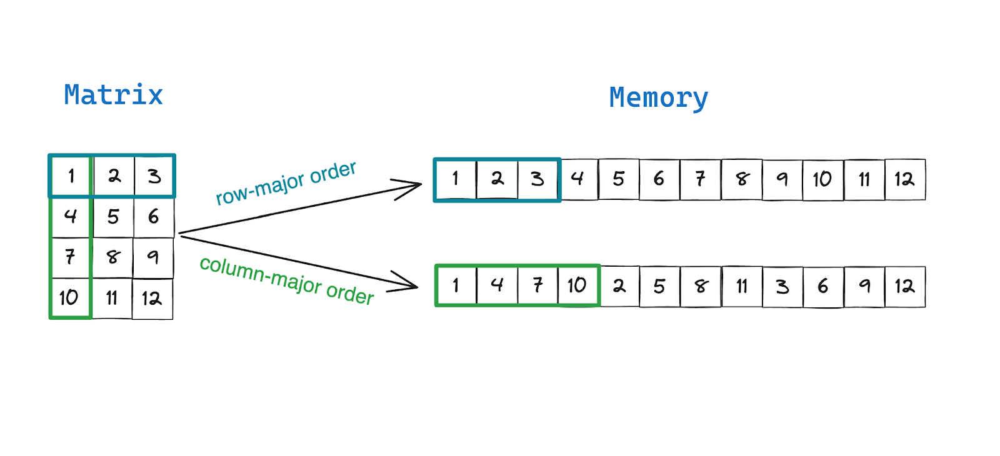

# Neural Networks in C

Low-level neural network implementation in C and POSIX threads parallelism.

## Overview

This project implements from scratch:

- Single Layer Perceptron (SLP)
- Multi-Layer Perceptron (MLP)
- Explicit backpropagation
- Custom BLAS-like linear algebra core
- Parallelization using POSIX threads (pthreads)

The goal is not to build a framework, is to understand how neural networks operate at a low level:
memory layout, numerical computation, and parallel execution.

## Roadmap

### Phase 1: Numerical Foundations
- [x] Matrix representation in row-major
- [x] Manual memory control
- [x] Vector operations
- [x] Linear Algebra core
- [x] Unit testing & Valgrind validation

### Phase 2: Low-Level Parallelization
- [x] Row partitioning strategy using pthreads
- [x] Parallel matrix-vector multiplication & matrix-matrix multiplication
- [x] Parallel batch operations
- [ ] Speedup benchmarking (Sequential vs Parallel)

### Phase 3: NN Infrastructure
- [ ] Activation functions & Derivatives
- [ ] Loss functions
- [ ] Weight Initialization (Xavier/He)

### Phase 4: SLP (Single Layer Perceptron)
- [ ] 4.1 Forward: `y = activation(Wx + b)`
- [ ] 4.2 Explicit Backward: `dW = dL/dy * x^T`, `db = dL/dy`
- [ ] 4.3 Training Loop: Forward -> Loss -> Backward -> Update
- [ ] 4.4 Validation: Data linearly separable convergence

### Phase 5: MLP (Multi Layer Perceptron)
- [ ] 5.1 Structure: Multi-layer model representation
- [ ] 5.2 Layer Caching: Storing Z and A states for backprop
- [ ] 5.3 General Backpropagation: Iterative chain rule implementation
- [ ] 5.4 Numerical Gradient Checking: Comparative validation

### Phase 6: Batch Processing
- [ ] 6.1 Vectorized input (Batch x Features)
- [ ] 6.2 Batched Matmul optimization
- [ ] 6.3 Aggregated gradient calculation

### Phase 7: Parallel Batch Training
- [ ] 7.1 Thread-level batch partitioning
- [ ] 7.2 Gradient reduction buffers and synchronization

### Phase 8 & 9: Performance Engineering
- [ ] 8.1 Persistent Thread Pool implementation
- [ ] 8.2 Task queue & Worker synchronization
- [ ] 9.1 Cache-aware optimization (Loop Tiling)
- [ ] 9.2 Memory alignment & Branch avoidance

### Phase 10: Robustness & Tooling
- [ ] 10.1 Data loader (CSV/Binary)
- [ ] 10.2 Integration tests (MLP training)
- [ ] 10.3 CLI for hyperparameter tuning
- [ ] 10.4 Shape assertions & Debug mode

### Phase 11: Extensions
- [ ] Advanced Optimizers (Adam, Momentum)
- [ ] Regularization (L2, Dropout)
- [ ] Model serialization (Save/Load binaries)

## Design Principles

- **C**
- **Row-major memory layout**
- **Manual memory management**
- **Explicit parallelism (pthreads)**
- **No hidden abstractions**

This project prioritizes clarity of execution over abstraction.

## Project Structure

```bash
Neural-Networks-in-C
├── assets/
├── include/
│   ├── matrix.h
│   ├── parallel.h
│   └── linalg.h
├── src/
│   ├── parallel/
│   │   ├── add_rowwise.c
│   │   ├── apply.c
│   │   ├── matmul.c
│   │   └── matvec.c
│   ├── matrix.c
│   └── linalg.c
├── tests/
│   └── test_*.c
├── build/ # compiled binaries
├── main.c # soon
├── run_valgrind.sh
└── Makefile
```

## Core Components

### Matrix Representation

All data is stored in row-major format:

```c
#define MAT_AT(m, i, j) ((m)->data[(i) * (m)->stride + (j)])
```



This enables:

- Cache-friendly access patterns
- Predictable memory layout
- Efficient parallelization

## Build

```bash
make
```
Compile all tests:

```bash
make test
```

run:

```bash
./build/test_matmul
./build/test_matvec
```

## Test Memory Leak

To use this feature, you need to install valgrind:

```bash
sudo apt-get install valgrind
```

You need to give permission to run the script:

```bash
chmod +x run_valgrind.sh
```

Then run:

```bash
./run_valgrind.sh test_matrix
```